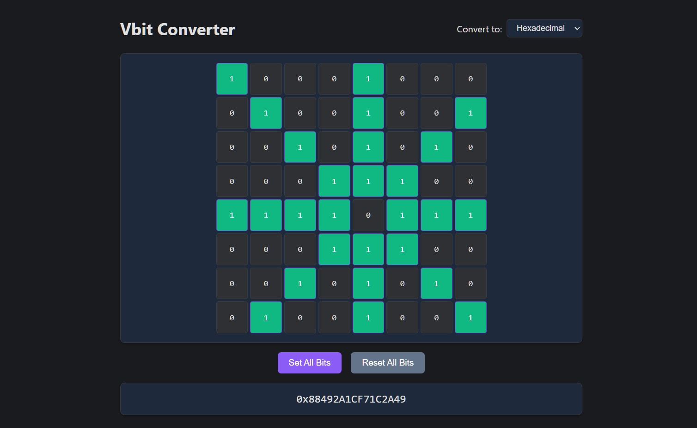

# Vbit converter
[View Online](https://moody-Jazz.github.io/Vbit-converter) 

**A visual tool for 8×8 bitboard configuration and conversion**  
Designed for game developers working with board game engines that uses the concept of [bitboards](https://en.wikipedia.org/wiki/Bitboard) like chess, checkers, othello or other board games.

  
*The interface showing a sample queen attack pattern from center of the board (0x88492A1CF71C2A49) in hexadecimal mode*

## Purpose
This tool provides an intuitive way to:
- Visually configure 8×8 bitboards
- Instantly convert bit patterns to decimal, hexadecimal, and octal values
- Simplify development of board game engines and AI

## Controls
| Action                    | Effect                              |
|---------------------------|-------------------------------------|
| Click or tap              | Toggle individual bit               |
| Click + drag              | Toggle multiple bits (desktop)      |
| Tap + drag                | Toggle multiple bits (mobile)       |
| Set All / Reset All       | Set all bits to 1 or 0              |

## License
This project is licensed under the MIT License. See the [LICENSE](LICENSE) file for details.